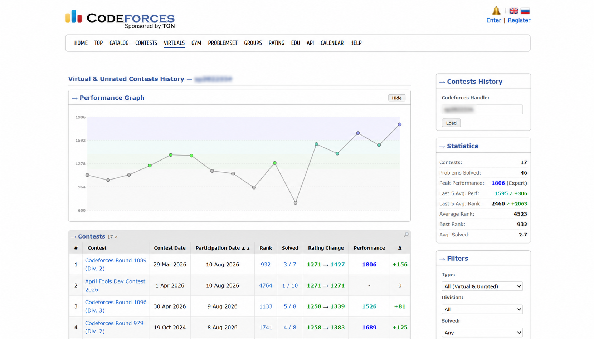
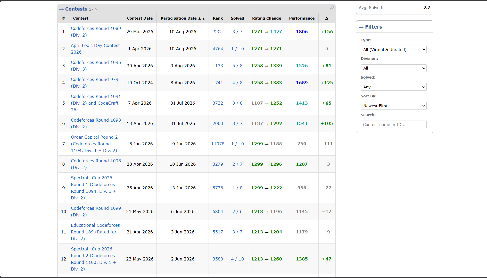
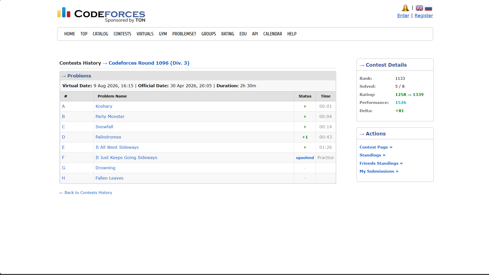

# Codeforces-Vcon

**Codeforces-Vcon** is a Chrome extension that integrates a dedicated virtual contest history and performance analytics interface directly into Codeforces. It enables competitive programmers to track, analyze, and visualize their performance across virtual and unrated practice contests with an authentic user interface.

---

## Features

* **Authentic Codeforces Interface:**
  * Injects a seamless `VIRTUALS` navigation tab into the Codeforces top navbar.

* **Simulated Live Rank:**
  * Evaluates your virtual submission timestamps, points, and attempt penalties, slotting your score directly into the **official live standings** among all contestants.

* **Performance Rating & Delta Engine:**
  * **Performance Rating ($R_{\text{perf}}$):** Determines the exact rating level at which you competed in each round (the rating where $\Delta = 0$).
  * **Rating Delta ($\Delta$):** Computes projected rating gains/losses using the official Elo win-probability formula with binary search seeds and multi-tier deflation adjustments.
  * *(For full mathematical formulas and derivation, see [CALCULATIONS.md](CALCULATIONS.md).)*

* **Interactive Performance Graph:**
  * Visualizes your performance rating progression over time.

* **Sidebar Statistics & Trend Analysis:**
  * **Peak Performance:** Highest performance rating achieved, displayed with official Codeforces rank colors and titles (e.g. *Candidate Master*, *Expert*).
  * **Last 5 Contests Average Performance & Rank:** Arithmetic mean of your 5 most recent contests with real-time trend indicators (`↗` / `↘`) comparing your recent form against your all-time historical baseline.

* **Progressive Page-Based Loading:**
  * Discovers all virtual participations and renders the table in under half a second.
  * Prioritizes rank and rating calculations for the currently visible page first, while background workers enrich remaining history without blocking user interaction.

* **Smart Filtering & Multi-Handle LRU Cache:**
  * Filter contests by Participation Type (*All*, *Virtual Only*, *Unrated Live Only*), Division (*Div. 1*, *Div. 2*, *Div. 3*, *Div. 4*, *Educational*, *Global*), Problems Solved, and Sort Order.
  * Multi-handle LRU cache supporting up to 25 accounts with permanent protection for your primary handle.

---

## Screenshots

<details>
<summary>Screenshot 1</summary>
<br>


</details>

<details>
<summary>Screenshot 2</summary>
<br>


</details>

<details>
<summary>Screenshot 3</summary>
<br>


</details>

---

## Installation

### Load Unpacked Extension in Chrome:

1. Clone or download this repository:
   ```bash
   git clone https://github.com/Agam-Patel-del/codeforces-vcon.git
   cd codeforces-vcon
   ```
2. Install dependencies and build the extension:
   ```bash
   npm install
   npm run build
   ```
3. Open Google Chrome and navigate to:
   ```text
   chrome://extensions/
   ```
4. Enable **Developer mode** (toggle in the top-right corner).
5. Click **Load unpacked** and select the built `dist` folder.
6. Open [Codeforces](https://codeforces.com/) to access the new **VIRTUALS** tab.

---

## Mathematical Specification

For a complete breakdown of scoring rules, seed evaluations, binary search root finding, and multi-tier rating adjustments, refer to **[CALCULATIONS.md](CALCULATIONS.md)**.

---

## Tech Stack

* **Frontend:** React 18, JSX
* **Build Tool:** Vite
* **Styling:** Vanilla CSS
* **API:** Official Codeforces REST API

---

## License

This project is open source and available under the [MIT License](LICENSE).
